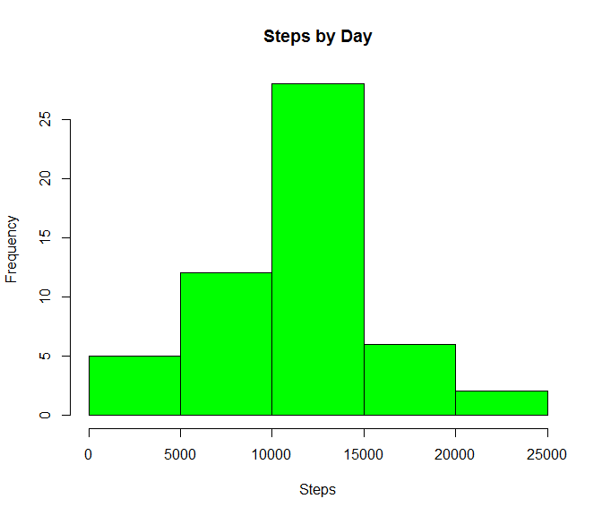
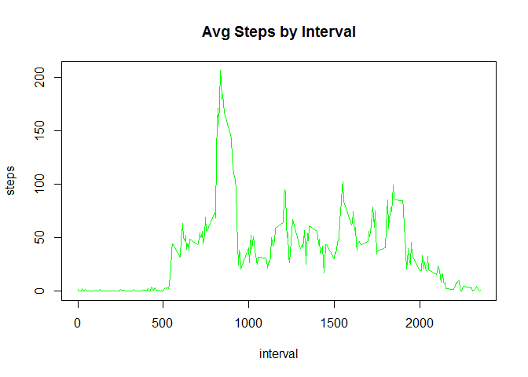
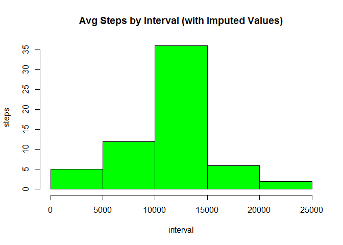
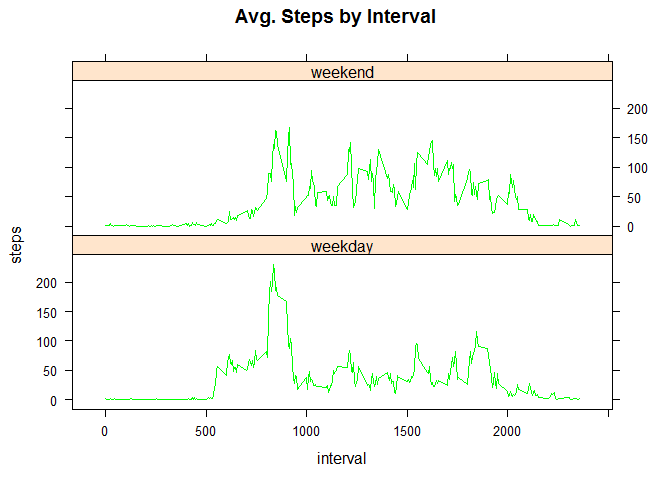

# Reproducible Research:  Peer Assessment 1
Greg Brockman  
July 15, 2016  

This is an R Markdown document which reads in activity monitoring data, analyzes it, and outputs an HTML file summarizing findings.

LOADING AND PREPROCESSING THE DATA

This code chunk reads in the data file from the working directory and converts the date column to a date format.


```r
activity <- read.csv("activity.csv", stringsAsFactors=FALSE)
activity$date <- as.Date(activity$date, format = "%m/%d/%Y")
```


WHAT IS MEAN TOTAL NUMBER OF STEPS TAKEN PER DAY?

This chunk sums the steps by date in table X, plots it, and gives mean and median.


```r
X <- tapply(activity$steps, activity$date, sum)
hist(X, col="green")
```

<!-- -->

```r
mean_daily_steps <- mean(X,na.rm=TRUE)
median_daily_steps <- median(X,na.rm=TRUE)
```

The mean number of daily steps is 1.0766189\times 10^{4} with a median of 10765


WHAT IS THE AVERAGE DAILY ACTIVITY PATTERN?

This chunk computes the average number of steps per interval (in table y) and then proceeds to plot the results and show max.


```r
y <- aggregate(activity$steps, by=list(activity$interval), mean, na.rm=TRUE)
colnames(y) <- c("interval","avg.steps")
plot(y$interval,y$avg.steps, type="l", col="green")
```

<!-- -->

```r
z <- which.max(y$avg.steps)
max.interval <- y$interval[z]
max.steps <- y$avg.steps[z]
```

The most active interval is 835 with average steps of 206.1698113


IMPUTING MISSING VALUES

This chunk fills imputes values for missing step measurements (imputed value is average for given interval).  It then plots
the resulting steps by date and displays the mean and median.


```r
nas <- sum(is.na(activity$steps))
```

There are 2304 missing values in the activity monitoring data set.
To get meaningful statistics from the data set, it is necessary to fill in the
missing values with imputed values based on the average for that interval.  
Below is a histogram of average steps per day with imputed values for NAs.


```r
library(zoo)
```

```
## Warning: package 'zoo' was built under R version 3.2.5
```

```
## 
## Attaching package: 'zoo'
```

```
## The following objects are masked from 'package:base':
## 
##     as.Date, as.Date.numeric
```

```r
activity$steps <- na.aggregate(activity$steps, by=activity$interval, FUN =  mean,na.rm=TRUE)
z <- tapply(activity$steps, activity$date, sum)
hist(z, col="green")
```

<!-- -->

```r
mean_daily_steps2 <- mean(z)
median_daily_steps2 <- median(z)
```

The mean number of daily steps is 1.0766189\times 10^{4} with a median of 1.0766189\times 10^{4}

Note that imputing data based on daily averages has very little impact on the overall mean and median of daily steps.  The histogram tells us that the imputed values drive an increase in observations of daily steps in the 10,000 to 15,000 range (the dominant block of observations) with essentially no impact on the lower and higher ranges.


ARE THERE DIFFERENCES IN ACTIVITY PATTERNS BETWEEN WEEKDAYS AND WEEKENDS?

This chunk adds columns for the day (daytype) and day group (daygroup = weekend/weekday).  It then plots the avg steps across
intervals for both daygroups.


```r
activity$daytype <- weekdays.Date(activity$date)
activity$daygroup <- ifelse(activity$daytype == "Saturday", "weekend", ifelse(activity$daytype == "Sunday", "weekend", "weekday" ))
agg <- aggregate(activity$steps, by=list(activity$interval, activity$daygroup), mean)
colnames(agg) <- c("interval","daygroup","avg.steps")
library(lattice)
xyplot(avg.steps ~ interval | daygroup, data=agg, type="l", layout = c(1,2), col="green")
```

<!-- -->
